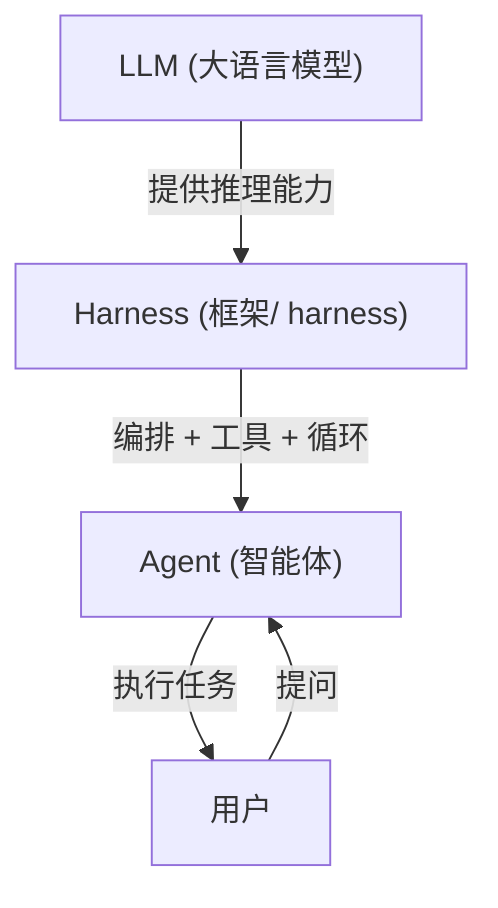
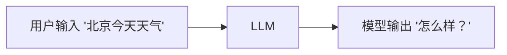
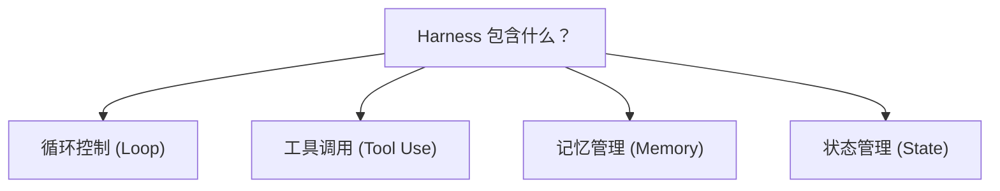
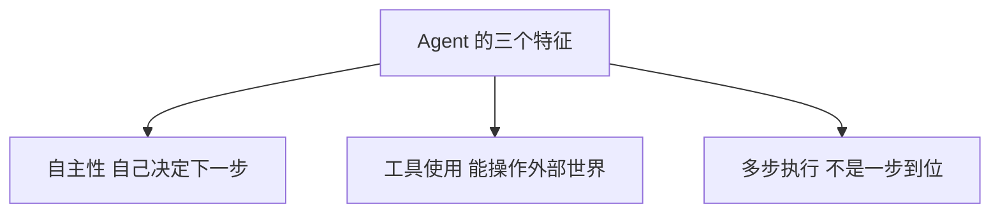
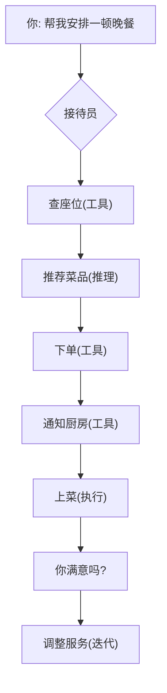
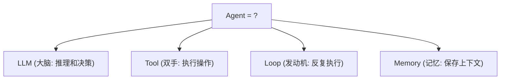
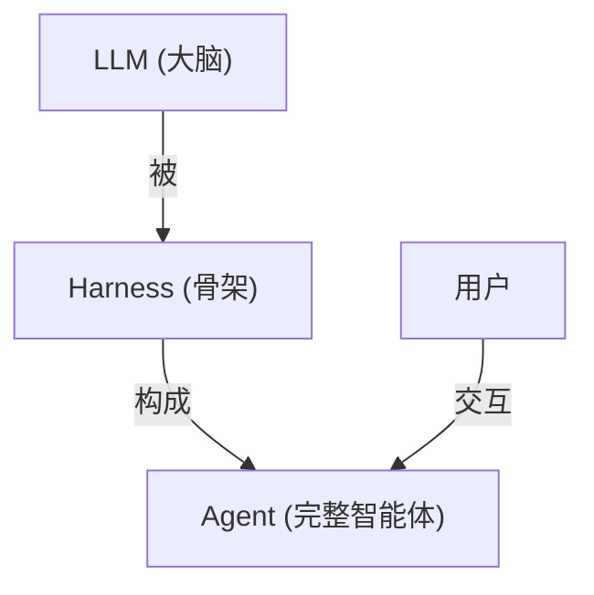

> 基于 [Lion-1209/AgentStudy](https://github.com/Lion-1209/AgentStudy) 仓库，对应代码见 `stage1-fundamentals/`

---

## 先搞清楚三个词：LLM、Harness、Agent

你最近可能频繁看到这三个词，但它们到底是什么意思？

简单说：**LLM 是大脑，Harness 是骨架，Agent 是完整的"人"。**

---

## LLM：大语言模型

**LLM = Large Language Model，大语言模型。**

就是大家熟悉的 ChatGPT、Claude、DeepSeek、通义千问这些东西。

它们能做什么？**读文字、写文字、回答问题、写代码。** 本质上是一个"超级文本补全器"——你给它一段文字，它预测接下来最可能出现的文字。

但 LLM 有一个致命限制：**它不能做事。** 它只能写文字，不能查天气、不能算数学题、不能操作数据库。

你问它"北京今天多少度"，它可能会编造一个数字，而不是真的去查。这个限制，催生了 Agent。

---

## Harness：框架

**Harness 在 Agent 语境下，就是"让 LLM 变成 Agent 的工具"。**

你可以把它理解成" harness = 框架 + 工具库 + 运行时"。

常见的 Harness：

| Harness | 特点 |
|---------|------|
| **LangChain** | 生态最丰富，适合复杂业务 |
| **LangGraph** | 状态图编排，适合有分支和循环的流程 |
| **OpenAI Agents SDK** | 轻量，新项目首选 |
| **Claude Agent SDK** | 和 Claude Code 同源 |
| **CrewAI** | 多 Agent 协作，角色扮演 |

> Harness 本身不是 Agent。它是用来搭建 Agent 的"建材"。

---

## Agent：智能体

**Agent = 能用 LLM + Harness 自主完成任务的系统。**

它有三个关键特征：

| 特征 | Chatbot | Agent |
|------|---------|-------|
| 自主决定 | 你问一句它答一句 | 自己能规划步骤 |
| 使用工具 | 只能写文字 | 能调用 API、执行代码 |
| 多步执行 | 一次响应 | 反复 Think→Act→Observe |

---

## 一个生活类比

想象你去了一家餐厅：

**接待员就是 Agent。** 他没有一次性回答你，而是反复调用各种资源，直到你满意。

而 LLM 就像一个只会说话的客服——它能说会道，但不能真的帮你订座位。

---

## Agent 四要素：LLM + Tool + Loop + Memory

理解了上面三个词，再来看 Agent 的四要素就顺了：

| 要素 | 来源 | 作用 |
|------|------|------|
| **LLM** | 大语言模型 | 提供推理能力 |
| **Tool** | Harness 提供 | 让 Agent 能操作外部世界 |
| **Loop** | Harness 提供 | 驱动 Think→Act→Observe 循环 |
| **Memory** | Harness 提供 | 保存对话历史和长期知识 |

**注意**：LLM 只提供"大脑"（推理），其他三个要素都是 Harness 提供的。

---

## 三者关系总结

- **LLM** 是"原料"，有智能但不能做事
- **Harness** 是"加工厂"，把 LLM 变成能做事的系统
- **Agent** 是"成品"，能自主完成任务的完整系统

---

## 学习检查清单

- [ ] 能用自己的话解释 LLM、Harness、Agent 三者的关系吗？
- [ ] 知道为什么 LLM 本身不能直接做 Agent 吗？
- [ ] 能举一个生活中类似 Agent 的例子吗？

---

## 延伸阅读

- 📖 [Anthropic: Building Effective Agents](https://www.anthropic.com/research/building-effective-agents)
- 📖 [OpenAI: A Practical Guide to Building Agents](https://cdn.openai.com/business-guides-and-resources/a-practical-guide-to-building-agents.pdf)
- 💻 仓库代码：`stage1-fundamentals/task1.1_minimal_react.py`
- 🗺️ 上一篇：无（系列起始）
- 🗺️ 下一篇：[02] ReAct 循环：Agent 的思考引擎
