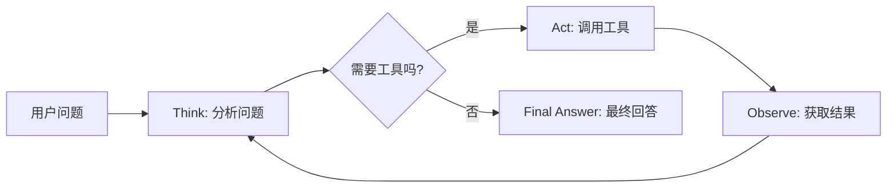
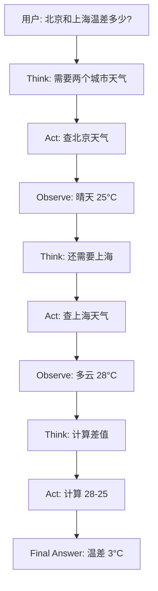

> 基于 [Lion-1209/AgentStudy](https://github.com/Lion-1209/AgentStudy) 仓库，对应代码见 `stage1-fundamentals/task1.1_minimal_react.py`

---

## ReAct 是什么？

**ReAct = Reasoning（推理）+ Acting（行动）**

Agent 最核心的运行模式。不是一步到位地回答，而是反复经历三个阶段的循环：

```
Think（思考） → Act（行动） → Observe（观察） → 回到 Think
```

---

## ReAct 循环图解



每一轮循环，Agent 都在获取新信息、修正判断。这就是为什么它能处理复杂任务。

---

## 三步拆解

| 阶段 | 发生什么 | 类比 |
|------|----------|------|
| **Think** | LLM 分析当前情况，决定下一步 | 人脑思考 |
| **Act** | 执行一个工具调用或生成回复 | 动手操作 |
| **Observe** | 获取工具返回的结果，作为下一轮的输入 | 观察反馈 |

---

## 为什么 ReAct 能 emergent 出智能？

你不需要教 Agent "先查天气再计算温差"。你只需要：

1. 给它工具（`get_weather`、`calculate`）
2. 让它自己决定用哪个、用几次
3. 它会自己规划步骤



**Agent 的"智能"不是被写死的，是从这个循环中涌现出来的。**

---

## 核心循环的代码骨架

```python
for step in range(max_iterations):
    # 1. Think: 让 LLM 分析当前情况
    response = llm.chat(messages)

    # 2. 检查是否需要调用工具
    if response.has_tool_call():
        # Act: 执行工具
        result = execute_tool(response.tool_call)
        # Observe: 把结果加入上下文
        messages.append({"role": "tool", "content": result})
    else:
        # 没有工具调用 → 任务完成
        return response.text
```

**注意：整个 Agent 的核心就是一个 for 循环 + LLM 调用。这就是全部。**

---

## 可观测性：Agent 的"黑匣子"

没有可观测性，你完全不知道 Agent 在干什么。最原始但最有效的方式：

```python
print(f"[步骤 {step}] LLM 输出: {response.text}")
print(f"[步骤 {step}] 执行工具: {tool_name}({tool_args})")
print(f"[步骤 {step}] 工具返回: {tool_result}")
```

这些 `print` 就是 Agent 的 trace。到阶段 5 我们会用 LangSmith/Langfuse 做专业的可观测性。

---

## 学习检查清单

- [ ] 能画出 ReAct 循环的三步流程图吗？
- [ ] 能解释为什么 Loop 是 Agent 和 Chatbot 的本质区别吗？
- [ ] 理解"涌现智能"在这个上下文中的含义了吗？

---

## 延伸阅读

- 💻 完整代码：`stage1-fundamentals/task1.1_minimal_react.py`
- 📖 论文：Chain-of-Thought Prompting Elicits Reasoning in Large Language Models
- 🗺️ 上一篇：[01] AI Agent 到底是什么？
- 🗺️ 下一篇：[03] Function Calling：让 LLM 拥有双手
