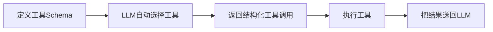

> 基于 [Lion-1209/AgentStudy](https://github.com/Lion-1209/AgentStudy) 仓库，对应代码见 `stage1-fundamentals/task1.2_tool_use.py` 和 `API_REFERENCE.md`

---

## 为什么需要 Function Calling？

上一篇我们用正则解析 LLM 的文本输出来获取工具调用信息。这种方式脆弱且不可靠。

Function Calling 是 LLM 提供商原生支持的结构化工具调用机制：



核心优势：LLM 原生理解工具接口，不需要你解析自由文本。

---

## 完整流程

```
1. 你定义工具（函数名 + 描述 + 参数 Schema）
2. 你把工具定义和用户问题一起发给 LLM
3. LLM 返回结构化工具调用（不是文本，是 JSON）
4. 你执行工具，拿到结果
5. 把结果作为 tool 消息送回 LLM
6. LLM 生成最终回答
```

---

## tool_choice 四种模式速查

| 模式 | 值 | 含义 | 适用场景 |
|------|-----|------|----------|
| **自动** | `"auto"` | LLM 自己决定是否调用工具 | 通用 Agent |
| **禁止** | `"none"` | 强制纯文本回复，不调用工具 | 纯对话场景 |
| **必须** | `"required"` | 必须调用至少一个工具 | 强制走工具流程 |
| **指定** | `{"type": "function", ...}` | 强制调用指定工具 | 路由到固定工具 |

---

## 工具定义的三个关键要素

```python
{
    "name": "get_weather",
    "description": "获取城市天气",
    "parameters": {
        "type": "object",
        "properties": {
            "city": {
                "type": "string",
                "description": "城市名，如'北京'"
            }
        },
        "required": ["city"]
    }
}
```

> 描述写作技巧：想象你在给一个聪明但不了解上下文的外包人员写任务说明。越具体，LLM 选对工具的概率越高。

---

## tool_call_id：为什么必须关联？

```python
# 一条工具调用请求和它的响应必须通过 id 关联
messages.append({
    "role": "assistant",
    "content": None,
    "tool_calls": [{"id": "call_abc123", ...}]
})

messages.append({
    "role": "tool",
    "tool_call_id": "call_abc123",  # 必须对应
    "content": "北京: 晴天 25°C"
})
```

**不关联会怎样？** LLM 不知道哪个结果对应哪个调用，对话上下文会乱。

---

## Function Calling vs 正则解析

| 维度 | 正则解析文本 | Function Calling |
|------|-------------|------------------|
| 可靠性 | 低，LLM 输出格式变化就会失败 | 高，LLM 原生支持结构化输出 |
| 解析难度 | 需要写复杂的正则 | 直接读取结构化字段 |
| 错误处理 | 难以区分"没调用"和"调用失败" | 有明确的 finish_reason 区分 |
| 性能 | 差 | 好 |

**结论：能用 Function Calling 就不要正则解析。这是可观测性的第一步——用可靠机制替代脆弱机制。**

---

## 学习检查清单

- [ ] 能说清楚 Function Calling 和文本解析的本质区别吗？
- [ ] tool_call_id 为什么不关联会出问题？
- [ ] tool_choice 的 4 种模式分别用在什么场景？
- [ ] 知道怎么写好工具描述吗？

---

## 延伸阅读

- 💻 完整代码：`stage1-fundamentals/task1.2_tool_use.py`
- 📖 API 参考：`API_REFERENCE.md` 第 4 节
- 🗺️ 上一篇：[02] ReAct 循环
- 🗺️ 下一篇：[04] 50 行代码实现最小 Agent
