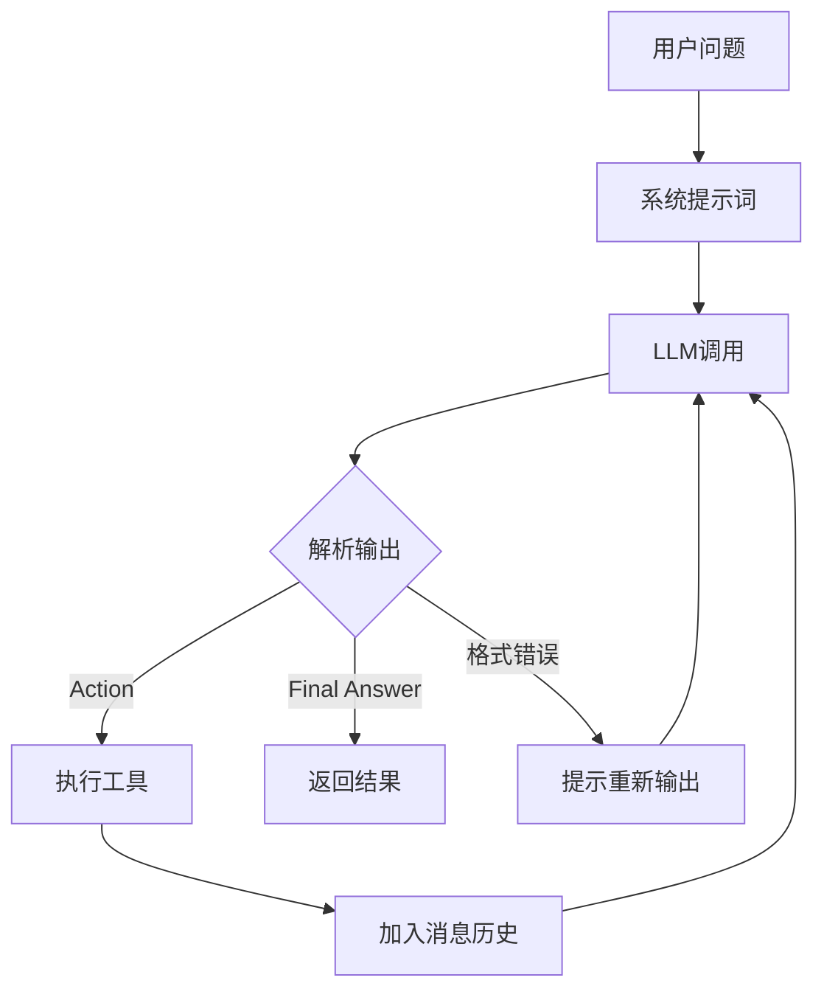

> 基于 [Lion-1209/AgentStudy](https://github.com/Lion-1209/AgentStudy) 仓库，完整代码：`stage1-fundamentals/task1.1_minimal_react.py`

---

## 为什么从零实现？

> **"框架 = 你手写的内核 + 工程化外壳"**

不理解内核，用框架就是黑盒。理解了内核，框架只是工具选择。

---

## 完整实现

### 第一步：定义工具

```python
# 工具 = 一个函数 + 描述信息
def get_weather(city: str) -> str:
    """获取指定城市的天气（模拟数据）"""
    weather_data = {
        "北京": "晴天，温度 25°C",
        "上海": "多云，温度 28°C",
        "深圳": "阵雨，温度 30°C",
    }
    return weather_data.get(city, f"未找到{city}的天气数据")

# 工具注册表
TOOLS = {
    "get_weather": {
        "func": get_weather,
        "description": "获取指定城市的天气信息",
        "params": {"city": "城市名称，如'北京'"}
    }
}
```

### 第二步：构建系统提示词

```python
def build_system_prompt() -> str:
    tool_descriptions = "\n".join(
        f"  - {name}: {info['description']}"
        for name, info in TOOLS.items()
    )
    return f"""你是一个有用的AI助手。你可以使用以下工具：

{tool_descriptions}

当你需要使用工具时，请严格按以下格式输出：
Thought: <你的思考过程>
Action: <工具名称>
Action Input: <工具参数的 JSON>

当你有了足够的信息可以回答用户时，请输出：
Thought: <你的思考过程>
Final Answer: <最终回答>

重要：每次只能使用一个工具。"""
```

> 这个提示词就是 Agent 的"灵魂"。它告诉 LLM 什么时候思考、什么时候行动、什么时候给出最终答案。

### 第三步：ReAct 循环（核心）

```python
def run_agent(user_query: str, max_iterations: int = 5) -> str:
    messages = [
        {"role": "system", "content": build_system_prompt()},
        {"role": "user", "content": user_query}
    ]

    for i in range(max_iterations):
        # 1. 调用 LLM
        response = client.chat.completions.create(
            model=model, messages=messages, temperature=0
        )
        assistant_message = response.choices[0].message.content

        # 2. 检查是否有最终回答
        final_answer = parse_final_answer(assistant_message)
        if final_answer:
            return final_answer

        # 3. 检查是否需要调用工具
        action_result = parse_action(assistant_message)
        if action_result:
            action_name, action_input = action_result
            if action_name in TOOLS:
                # 执行工具
                tool_result = TOOLS[action_name]["func"](action_input)
                # 把结果喂回 LLM（这就是 Observe）
                messages.append({"role": "assistant", "content": assistant_message})
                messages.append({
                    "role": "user",
                    "content": f"Observation: {tool_result}\n\n请继续思考。"
                })

    return "抱歉，我无法在规定步数内完成任务。"
```

### 运行效果

```python
# 测试 1：简单工具调用
result = run_agent("北京今天天气怎么样？")

# 测试 2：多步推理
result = run_agent("帮我查一下北京和上海的天气，然后算一下温差")
```

---

## 核心架构图



---

## 关键设计决策

| 决策 | 选择 | 原因 |
|------|------|------|
| 工具调用机制 | 正则解析 | 教学用，直观理解 ReAct 格式 |
| 消息历史 | 简单列表 | 短期记忆，后面会扩展 |
| 循环终止 | 最大步数限制 | 防止无限循环 |
| 错误处理 | 简单提示 | 生产环境需要更 robust 的处理 |

> 这个实现是教学用的。生产环境要用 Function Calling API 和成熟的框架。

---

## 学习检查清单

- [ ] 能手写这个最小 Agent 循环（不看参考）吗？
- [ ] 能解释消息历史（messages）的作用吗？
- [ ] 理解为什么 Observation 要作为新消息加入历史吗？

---

## 延伸阅读

- 💻 完整代码：`stage1-fundamentals/task1.1_minimal_react.py`
- 📖 概念文档：`docs/stage1/what-is-agent.md`
- 🗺️ 上一篇：[03] Function Calling
- 🗺️ 下一篇：[05] Agent 的记忆系统
