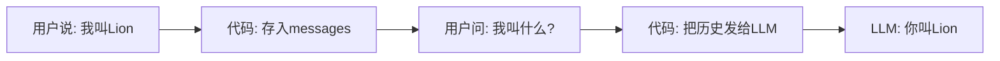
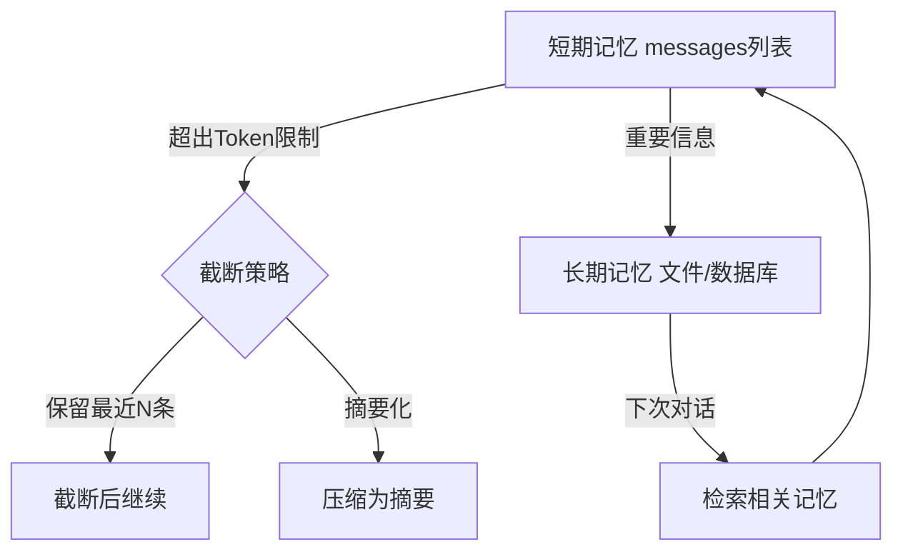
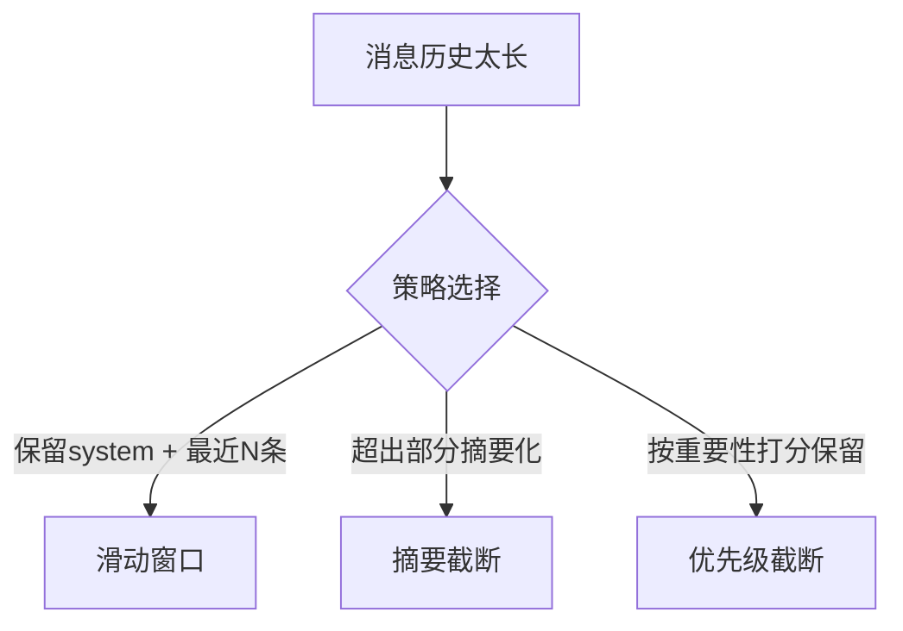
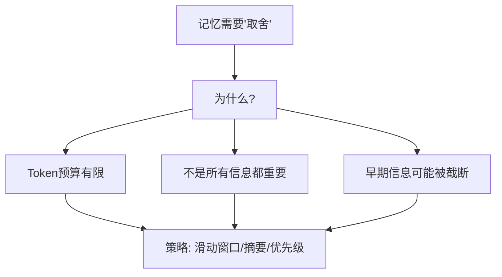

> 基于 [Lion-1209/AgentStudy](https://github.com/Lion-1209/AgentStudy) 仓库，对应代码见 `stage1-fundamentals/task1.3_memory.py`

---

## 一个关键问题：LLM 本身有记忆吗？

没有。

LLM 是无状态的。每次调用都是独立的，它不记得你上句话说了什么。

Agent 的记忆，是代码维护的。



是代码在"记住"，不是 LLM。

---

## 两种记忆：类比计算机存储

| 记忆类型 | 类比 | 实现方式 | 特点 |
|----------|------|----------|------|
| **短期记忆** | RAM（内存） | 消息列表 `messages` | 快但易失，对话结束就没了 |
| **长期记忆** | Flash（硬盘） | 文件/数据库存储 | 持久化，可跨对话检索 |



---

## 短期记忆：消息历史的 Token 管理

```python
messages = [
    {"role": "system", "content": "你是一个助手"},
    {"role": "user", "content": "我叫Lion"},
    {"role": "assistant", "content": "你好Lion！"},
    {"role": "user", "content": "我叫什么?"}
]
```

**问题来了**：Token 有限（通常 8K-128K），对话太长怎么办？

### 三种截断策略



| 策略 | 实现 | 优缺点 |
|------|------|--------|
| **滑动窗口** | 保留 system + 最近 N 条 | 简单，但会丢失早期重要信息 |
| **摘要截断** | 超出的消息让 LLM 生成摘要 | 保留语义，但增加 LLM 调用成本 |
| **优先级截断** | 给每条消息打分，保留高分 | 最智能，但实现复杂 |

---

## 长期记忆：持久化存储

```python
import json

# 保存重要信息到文件
def save_memory(key: str, value: str):
    memory = load_all_memories()
    memory[key] = value
    with open("memory.json", "w") as f:
        json.dump(memory, f)

# 检索相关记忆
def retrieve_memory(query: str) -> list:
    all_memories = load_all_memories()
    # 简单实现：关键词匹配
    # 进阶：向量相似度检索（阶段 5 讲 RAG）
    return [v for k, v in all_memories.items() if query in k]
```

---

## 记忆的本质：取舍



**记忆管理的本质就是在有限的空间里，尽可能保留最有价值的信息。**

---

## 学习检查清单

- [ ] 能解释为什么 LLM 本身没有记忆、是代码在维护记忆吗？
- [ ] 短期记忆和长期记忆的本质区别是什么（用 RAM/Flash 类比）？
- [ ] 知道为什么记忆需要"取舍"，有哪几种策略吗？

---

## 延伸阅读

- 💻 完整代码：`stage1-fundamentals/task1.3_memory.py`
- 📖 概念文档：`docs/stage1/memory-and-context.md`
- 🗺️ 上一篇：[04] 50 行代码实现最小 Agent
- 🗺️ 下一篇：[06] smolagents 源码导读
