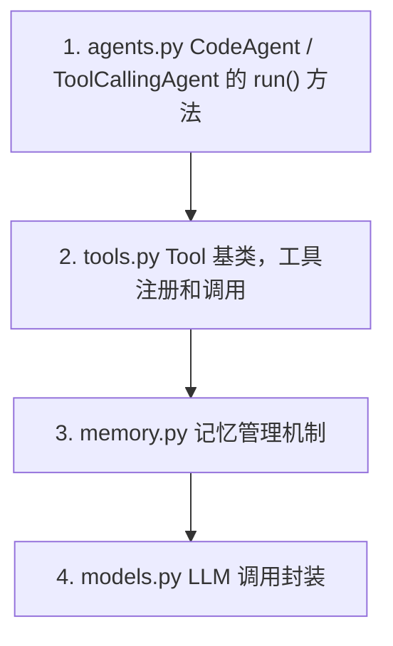
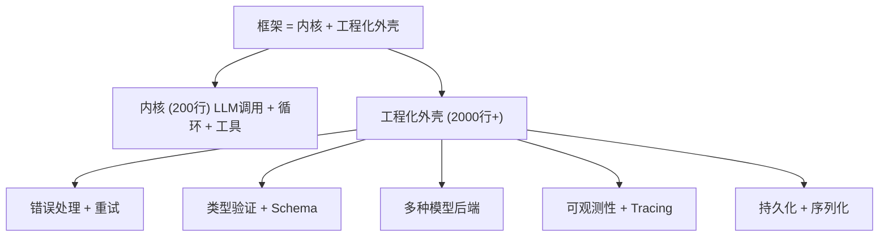

> 基于 [Lion-1209/AgentStudy](https://github.com/Lion-1209/AgentStudy) 仓库，参考 LEARNING_PLAN.md Task 1.4

---

## 为什么读源码？

你花了几小时写的最小 Agent 只有 200 行。smolagents 有几千行。差异在哪里？

> **框架 = 你手写的内核 + 工程化外壳**

理解这个外壳，你就理解了框架存在的意义。

---

## 三步阅读路线



---

## 三个核心区别

### 1. 工具系统：从字典到类

**你的实现：**
```python
TOOLS = {
    "get_weather": {"func": get_weather, "description": "..."}
}
```

**smolagents：**
```python
class Tool:
    def __init__(self, name, description, inputs, output_type):
        self.name = name
        self.description = description
        self.inputs = inputs  # 结构化 Schema
        self.output_type = output_type

    def __call__(self, *args, **kwargs):
        return self.forward(*args, **kwargs)
```

**区别**：smolagents 用类封装，支持类型检查、输入验证、输出格式化。你的字典是"能用就行"，smolagents 是"可维护、可扩展"。

### 2. Agent 循环：从简单 for 到状态机

**你的实现：**
```python
for i in range(max_iterations):
    response = llm.chat(messages)
    # 解析、执行、继续
```

**smolagents：**
```python
class ToolCallingAgent:
    def run(self, task):
        while not self.is_finished():
            # 1. 检查是否已经完成
            # 2. 决定下一步：调用工具还是给出答案
            # 3. 执行工具（带错误处理和重试）
            # 4. 更新内部状态
            # 5. 检查终止条件
```

**区别**：smolagents 有明确的状态管理（是否完成、当前步骤、重试计数），你的实现是隐式的。

### 3. 模型层：从直接调用到抽象接口

**你的实现：**
```python
response = client.chat.completions.create(...)
```

**smolagents：**
```python
class Model:
    def generate(self, messages, tools):
        # 统一的生成接口
        # 支持多种模型后端（OpenAI / Anthropic / HuggingFace）
        pass

class OpenAIModel(Model):
    def generate(self, messages, tools):
        # OpenAI 具体实现
        pass
```

**区别**：smolagents 用抽象接口屏蔽底层差异，你直接绑定了一个 API。

---

## 对比总结

| 维度 | 你的实现 | smolagents |
|------|----------|------------|
| 工具定义 | 字典 | 类 + Schema 验证 |
| 循环控制 | 隐式 for 循环 | 显式状态机 |
| 模型抽象 | 直接调用 | 统一接口 |
| 错误处理 | 简单 try-except | 分层处理 + 重试机制 |
| 可观测性 | print 语句 | 内置 logging + tracing 钩子 |
| 代码行数 | ~200 | ~2000+ |

---

## 核心感悟



**你写的 200 行就是内核。框架的几千行是让这个内核在生产环境中可靠运行所需的一切。**

理解了这一点，学习任何新框架都只是"找对应的工程化能力在哪里"。

---

## 学习检查清单

- [ ] 能说出 smolagents 比你的实现多了哪些工程化能力吗？
- [ ] 理解了"框架 = 你手写的内核 + 工程化外壳"吗？
- [ ] 能独立阅读 `agents.py` 的 `run()` 方法了吗？

---

## 延伸阅读

- 📦 smolagents 源码：https://github.com/huggingface/smolagents
- 🗺️ 上一篇：[05] Agent 的记忆系统
- 🗺️ 下一篇：[07] 4 大框架横评手册
