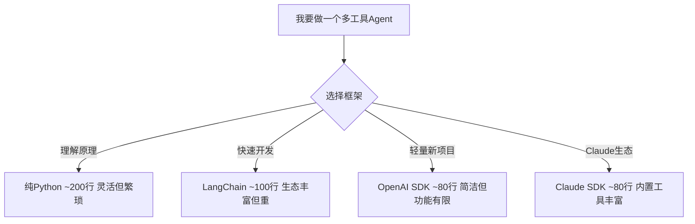
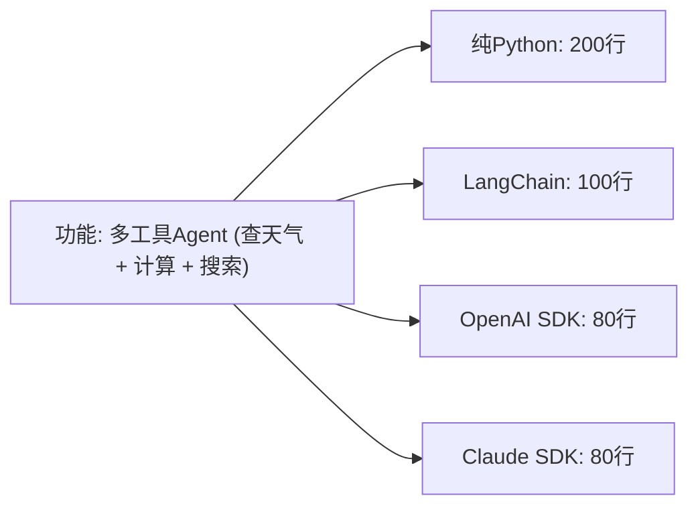
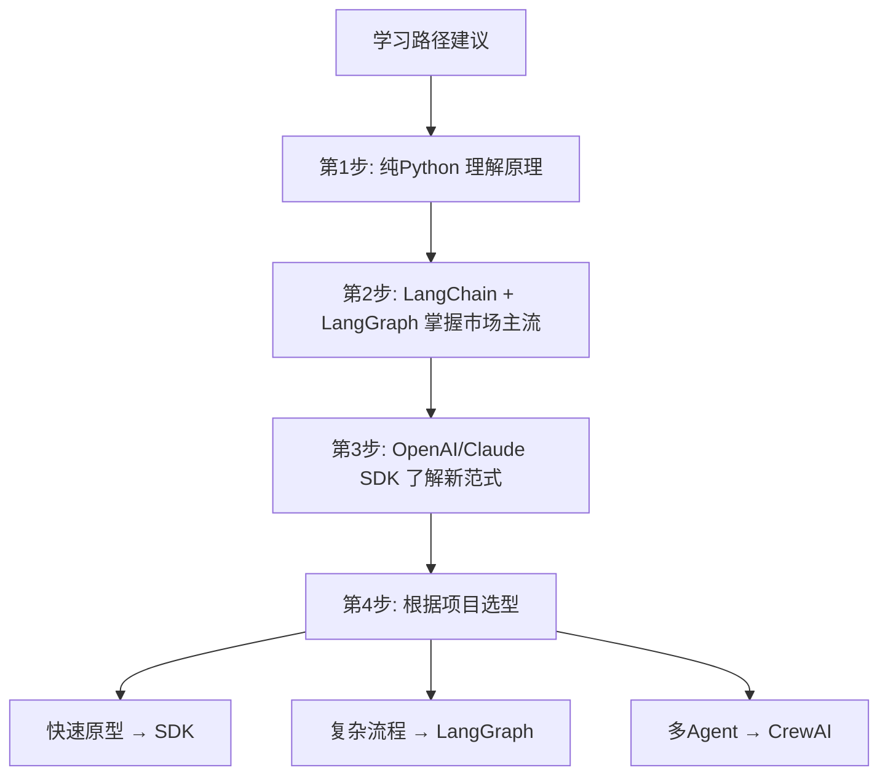

> 基于 [Lion-1209/AgentStudy](https://github.com/Lion-1209/AgentStudy) 仓库

---

## 一个问题的多种答案

同样的功能，用不同框架实现，代码量和复杂度天差地别。



---

## 五维对比表

| 维度 | 纯 Python | LangChain | OpenAI SDK | Claude SDK |
|------|-----------|-----------|------------|------------|
| **代码行数**（多工具Agent） | ~200 | ~100 | ~80 | ~80 |
| **上手难度** | 需要理解原理 | 抽象层多 | 简洁直观 | 简洁直观 |
| **灵活性** | 完全控制 | 受框架约束 | 轻量灵活 | 轻量灵活 |
| **生产就绪度** | 需要自己造轮子 | 生态完善 | 较新，生态在成长 | 较新，生态在成长 |
| **适合场景** | 学习原理 | 复杂业务流 | 新项目快速启动 | Claude 生态项目 |

---

## 决策树：怎么选？

```
你需要 Agent 吗？
│
├─ 只是想理解 Agent 原理 → 纯 Python（阶段1）
│
├─ 需要快速搭建原型 → OpenAI Agents SDK / Claude Agent SDK
│
├─ 需要复杂工作流（条件分支、循环、人工介入） → LangGraph
│
├─ 需要多 Agent 协作 → CrewAI / LangGraph
│
└─ 生产级复杂系统 → LangChain + LangGraph + LangSmith
```

---

## 各框架设计哲学对比

| 框架 | 设计哲学 | 一句话总结 |
|------|----------|-----------|
| **纯 Python** | 理解本质 | 所有框架的起点 |
| **LangChain** | 万能工具箱 | 给你所有你可能需要的工具 |
| **LangGraph** | 状态图编排 | 复杂流程的可视化与控制 |
| **OpenAI SDK** | 轻量原生 | 少即是多，框架退场 |
| **Claude SDK** | 运行时一致 | 和 Claude Code 用一样的引擎 |
| **CrewAI** | 角色扮演 | 用角色驱动多 Agent 协作 |

---

## 代码量对比



**趋势：框架越来越轻，抽象越来越少。**

---

## 我的建议



---

## 学习检查清单

- [ ] 能根据项目需求选择合适框架了吗？
- [ ] 理解"代码越少不一定越好"吗？（少代码 = 少控制）
- [ ] 知道什么时候该用 LangGraph 什么时候该用 SDK 吗？

---

## 延伸阅读

- 📖 框架对比原文：README.md 框架对比表
- 💻 各框架代码：`stage1/` `stage2/` `stage3/` `stage4/`
- 🗺️ 上一篇：[06] smolagents 源码导读
- 🗺️ 下一篇：[08] LangChain 入门
