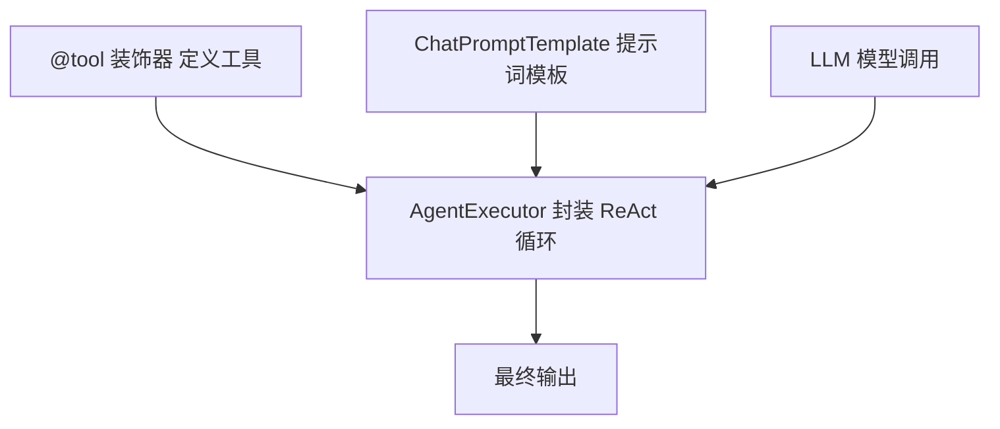
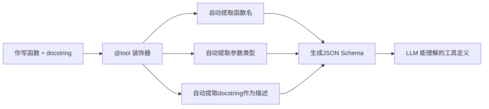

> 基于 [Lion-1209/AgentStudy](https://github.com/Lion-1209/AgentStudy) 仓库，对应代码见 `stage2-langchain/task2.1_langchain_agent.py`

---

## 从 200 行到 100 行：框架的价值

上一篇你用手写了 200 行的最小 Agent。现在用 LangChain，同样的功能只需要 100 行。

框架不改变本质，只是把重复的工作封装起来。

---

## LangChain Agent 的核心组件



三个组件 = 一个 Agent。

---

## 5 分钟搭一个 Agent

### 步骤 1：定义工具（用装饰器）

```python
from langchain_core.tools import tool

@tool
def get_weather(city: str) -> str:
    """获取指定城市的天气信息。

    Args:
        city: 城市名称，如'北京'
    """
    weather_data = {
        "北京": "晴天，温度 25°C",
        "上海": "多云，温度 28°C",
    }
    return weather_data.get(city, f"未找到{city}的天气数据")

@tool
def calculate(expression: str) -> str:
    """计算数学表达式。

    Args:
        expression: 数学表达式，如 '2 + 3 * 4'
    """
    return str(eval(expression))

tools = [get_weather, calculate]
```

> 装饰器的魔法：`@tool` 自动从函数签名和 docstring 生成 JSON Schema。你不需要手写工具描述。

### 步骤 2：创建 Agent

```python
from langchain_openai import ChatOpenAI
from langchain.agents import create_agent

llm = ChatOpenAI(model="gpt-4o-mini")
agent = create_agent(llm, tools=tools)
```

### 步骤 3：运行

```python
result = agent.invoke({"messages": [{"role": "user", "content": "北京天气怎么样？"}]})
print(result["messages"][-1].content)
```

**就这么简单。3 个步骤，一个可用的 Agent。**

---

## 对比：纯 Python vs LangChain

| 维度 | 纯 Python | LangChain |
|------|-----------|-----------|
| 工具定义 | 手写字典 + 描述 | `@tool` 装饰器自动生成 Schema |
| ReAct 循环 | 自己写 while 循环 | `AgentExecutor` 自动封装 |
| 提示词管理 | 字符串拼接 | `ChatPromptTemplate` 模板化 |
| 错误处理 | 手动 try-except | 内置错误处理机制 |
| 调试 | print 语句 | LangSmith 集成 |

---

## @tool 装饰器原理



**你只写业务逻辑，框架帮你生成 Schema。**

---

## 学习检查清单

- [ ] 能用 @tool 装饰器定义一个工具吗？
- [ ] 知道 AgentExecutor 封装了什么吗？
- [ ] 能对比出 LangChain 相比纯 Python 省掉了哪些重复代码吗？

---

## 延伸阅读

- 💻 完整代码：`stage2-langchain/task2.1_langchain_agent.py`
- 📖 API 参考：`LANGCHAIN_REFERENCE.md`
- 🗺️ 上一篇：[07] 4 大框架横评手册
- 🗺️ 下一篇：[09] 多工具 Agent + 错误处理
