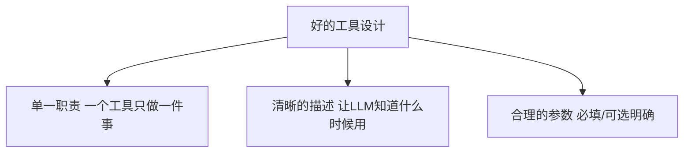
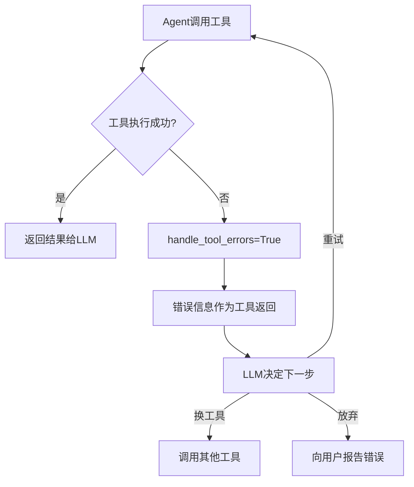
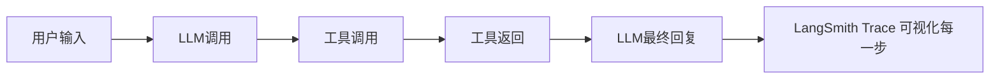

> 基于 [Lion-1209/AgentStudy](https://github.com/Lion-1209/AgentStudy) 仓库，对应代码见 `stage2-langchain/task2.2_multi_tool_agent.py`

---

## 从单工具到多工具：设计原则

一个生产级 Agent 通常需要 4-5 个工具。但工具不是越多越好。

### 工具设计三原则



| 原则 | 反例 | 正例 |
|------|------|------|
| 单一职责 | `do_everything()` | `get_weather()` / `calculate()` |
| 清晰描述 | "一个工具" | "获取指定城市的天气信息，参数：城市名" |
| 合理参数 | 10个参数全可选 | 2个参数，1个必填 |

---

## 错误处理：Agent 不能因为一个工具失败就崩溃

```python
from langchain.agents import create_agent

agent = create_agent(
    llm,
    tools=tools,
    # 工具执行失败时，让 Agent 自行处理，不崩溃
    handle_tool_errors=True,
)
```

### 错误处理流程



**关键设计：工具失败不是异常，而是 Agent 需要处理的正常情况。**

---

## 输出解析：从自由文本到结构化数据

LLM 的输出是自由文本，但你的程序需要结构化数据。

```python
from langchain_core.output_parsers import JsonOutputParser

# 定义你期望的输出格式
parser = JsonOutputParser(pydantic_object=WeatherReport)

# Agent 输出会被自动解析为结构化对象
result = agent.invoke({"messages": [...]})
weather = parser.parse(result)
```

| 解析器 | 用途 | 示例 |
|--------|------|------|
| `StrOutputParser` | 纯文本输出 | 对话回复 |
| `JsonOutputParser` | JSON 格式 | API 响应 |
| `PydanticOutputParser` | 带验证的 JSON | 需要校验的数据 |

---

## 可观测性：看见 Agent 在干什么

```python
import os
os.environ["LANGCHAIN_TRACING_V2"] = "true"
os.environ["LANGCHAIN_API_KEY"] = "your-key"
```

开启后，每次 Agent 运行都会在 LangSmith 生成 trace：



**Trace 包含的信息：**
- 每一步的输入输出
- Token 用量和延迟
- 工具调用链
- 错误信息

> 没有 trace 就没法调试 Agent。你无法从最终输出反推中间出了什么问题。

---

## 调试技巧速查

| 问题 | 排查方法 |
|------|----------|
| Agent 选错了工具 | 检查工具描述是否清晰 |
| Agent 循环调用同一个工具 | 检查是否有终止条件 |
| Agent 输出格式不对 | 检查输出解析器配置 |
| Agent 很慢 | 查看 trace 中的延迟分布 |
| Agent 经常失败 | 开启 handle_tool_errors + 查看 LangSmith |

---

## 学习检查清单

- [ ] 知道工具设计的三个原则吗？
- [ ] 会用 `handle_tool_errors=True` 吗？
- [ ] 能接入 LangSmith 查看 trace 吗？

---

## 延伸阅读

- 💻 完整代码：`stage2-langchain/task2.2_multi_tool_agent.py`
- 📖 API 参考：`LANGCHAIN_REFERENCE.md`
- 🗺️ 上一篇：[08] LangChain 入门
- 🗺️ 下一篇：[10] LangGraph 核心
