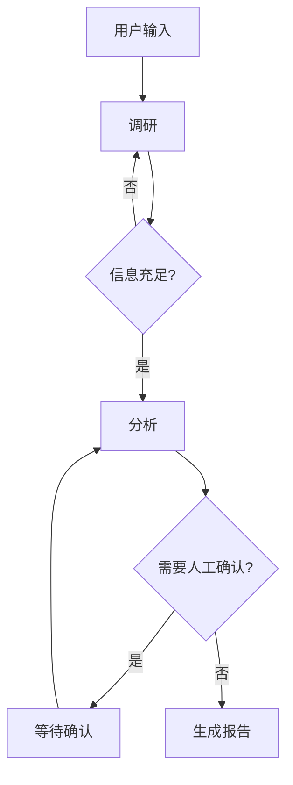
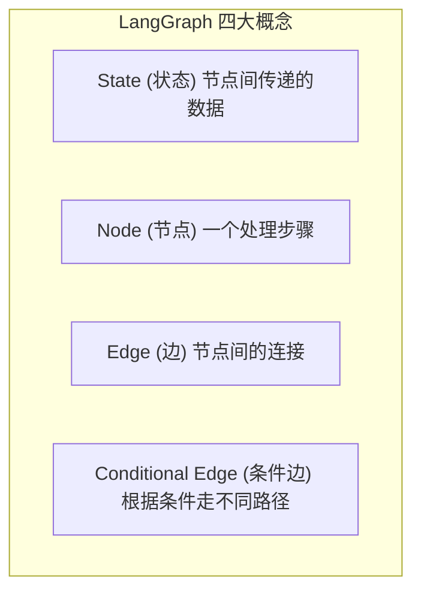
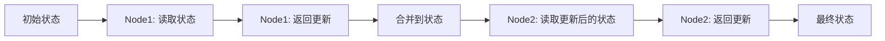

> 基于 [Lion-1209/AgentStudy](https://github.com/Lion-1209/AgentStudy) 仓库，对应代码见 `stage2-langchain/task2.3_langgraph_basics.py`

---

## 为什么需要 LangGraph？

AgentExecutor 适合单 Agent + 工具调用的场景。但现实中的工作流更复杂：



**这种条件分支 + 循环 + 人工介入的流程，用 if-else 写就是噩梦。LangGraph 用图来解决。**

---

## LangGraph 四大概念



| 概念 | 类比 | 说明 |
|------|------|------|
| **State** | 表单 | 在节点之间传递的数据 |
| **Node** | 处理步骤 | 一个函数，读 State → 返回更新 |
| **Edge** | 箭头 | 确定性连接：A → B |
| **Conditional Edge** | 岔路口 | 根据条件决定走哪条路 |

---

## 核心代码骨架

### 步骤 1：定义状态

```python
from typing import TypedDict, Annotated
from langgraph.graph import add_messages

class WorkflowState(TypedDict):
    messages: Annotated[list, add_messages]
    question: str
    research_result: str
    needs_more_research: bool
```

### 步骤 2：定义节点

```python
def research_node(state: WorkflowState) -> dict:
    """调研节点：收集信息"""
    response = llm.invoke(f"调研这个问题: {state['question']}")
    return {"research_result": response.content}

def analysis_node(state: WorkflowState) -> dict:
    """分析节点：判断信息是否充足"""
    response = llm.invoke(f"分析: {state['research_result']}")
    return {"needs_more_research": True}
```

### 步骤 3：构建图

```python
from langgraph.graph import StateGraph, START, END

workflow = StateGraph(WorkflowState)

# 添加节点
workflow.add_node("research", research_node)
workflow.add_node("analysis", analysis_node)

# 添加边（确定性连接）
workflow.add_edge(START, "research")
workflow.add_edge("research", "analysis")

# 添加条件边
workflow.add_conditional_edges(
    "analysis",
    should_continue_research,
    {"research": "research", "report": "report"}
)

workflow.add_edge("report", END)

# 编译
app = workflow.compile()
```

### 步骤 4：运行

```python
result = app.invoke({
    "messages": [],
    "question": "2026年 AI Agent 最重要的趋势是什么？",
})
```

---

## 状态传递机制



**每个节点只返回它修改的部分，框架自动合并到完整状态。**

---

## LangGraph vs 手写 if-else

| 维度 | 手写 if-else | LangGraph |
|------|-------------|-----------|
| 流程可视化 | 需要自己画图 | 内置 `print_ascii()` |
| 状态追踪 | 难以追踪 | 每步状态可查询 |
| 可恢复 | 需要自己实现 | 支持 checkpoint |
| 循环控制 | 手动管理 | 内置重试机制 |
| 人工介入 | 需要自己写 | `interrupt_before` 一行代码 |

---

## 学习检查清单

- [ ] 能解释 State / Node / Edge / Conditional Edge 四个概念吗？
- [ ] 能手写一个简单的 StateGraph 吗？
- [ ] 理解 LangGraph 和 if-else 的本质区别了吗？

---

## 延伸阅读

- 💻 完整代码：`stage2-langchain/task2.3_langgraph_basics.py`
- 📖 LangGraph 官方教程：https://langchain-ai.github.io/langgraph/tutorials/
- 🗺️ 上一篇：[09] 多工具 Agent + 错误处理
- 🗺️ 下一篇：[11] LangGraph 实战：代码审查流水线
