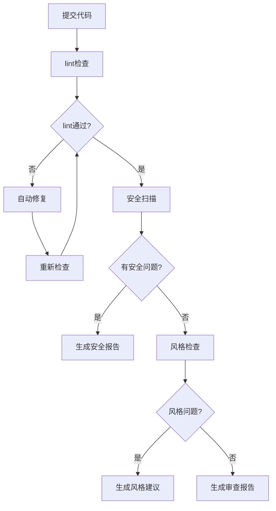
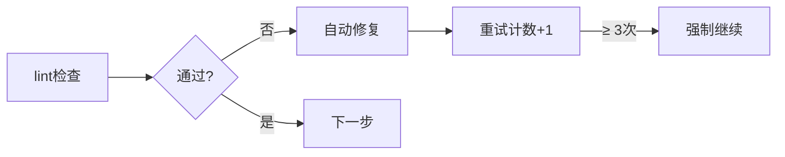

> 基于 [Lion-1209/AgentStudy](https://github.com/Lion-1209/AgentStudy) 仓库，对应代码见 `stage2-langchain/task2.4_code_review_agent.py`

---

## 实战场景：代码审查流水线

代码审查通常需要多个步骤，而且有明确的流程逻辑：



**这个流程用 if-else 写至少要几百行，用 LangGraph 只需要定义节点和边。**

---

## 完整实现

### 定义状态

```python
class CodeReviewState(TypedDict):
    code: str                    # 待审查的代码
    lint_result: str             # lint 检查结果
    security_result: str         # 安全扫描结果
    style_result: str            # 风格检查结果
    final_report: str            # 最终报告
    needs_fix: bool              # 是否需要修复
    retry_count: int             # 重试次数
```

### 定义节点

```python
def lint_check(state: CodeReviewState) -> dict:
    """节点1：lint 检查"""
    result = run_linter(state["code"])
    return {"lint_result": result}

def security_scan(state: CodeReviewState) -> dict:
    """节点2：安全扫描"""
    result = run_security_scanner(state["code"])
    return {"security_result": result}

def style_check(state: CodeReviewState) -> dict:
    """节点3：风格检查"""
    result = run_style_checker(state["code"])
    return {"style_result": result}

def generate_report(state: CodeReviewState) -> dict:
    """节点4：生成报告"""
    report = compile_report(state)
    return {"final_report": report}
```

### 定义条件路由

```python
def should_fix(state: CodeReviewState) -> str:
    """lint 不通过 → 修复 → 重新检查"""
    if not state.get("lint_passed") and state.get("retry_count", 0) < 3:
        return "fix"
    return "security_scan"

def human_approval(state: CodeReviewState) -> str:
    """等待人工确认后继续"""
    return "generate_report"
```

---

## 核心特性实战

### 1. 循环重试



### 2. 人工介入

```python
# 在关键节点暂停，等待人工确认
app = workflow.compile(
    interrupt_before=["human_approval"]
)

# 恢复执行
app.invoke(initial_state, config={"configurable": {"thread_id": "1"}})
```

### 3. 条件分支

```python
workflow.add_conditional_edges(
    "lint_check",
    should_fix,
    {"fix": "fix_code", "continue": "security_scan"}
)
```

---

## LangGraph 的核心价值

| 特性 | 解决的问题 | 你的代码 |
|------|-----------|----------|
| 可视化 | 复杂流程一目了然 | `app.get_graph().print_ascii()` |
| 状态追踪 | 每步数据可查 | State 自动传递 |
| 可恢复 | 任意节点暂停/恢复 | checkpoint |
| 循环控制 | 自动重试 + 最大次数 | 内置机制 |
| 人工介入 | 关键节点暂停 | `interrupt_before` |

---

## 学习检查清单

- [ ] 能画出代码审查流水线的完整流程图吗？
- [ ] 知道怎么实现循环重试吗？
- [ ] 理解 `interrupt_before` 的用途了吗？

---

## 延伸阅读

- 💻 完整代码：`stage2-langchain/task2.4_code_review_agent.py`
- 📖 概念文档：`docs/stage2/state-machine-thinking.md`
- 🗺️ 上一篇：[10] LangGraph 核心
- 🗺️ 下一篇：[12] OpenAI Agents SDK
