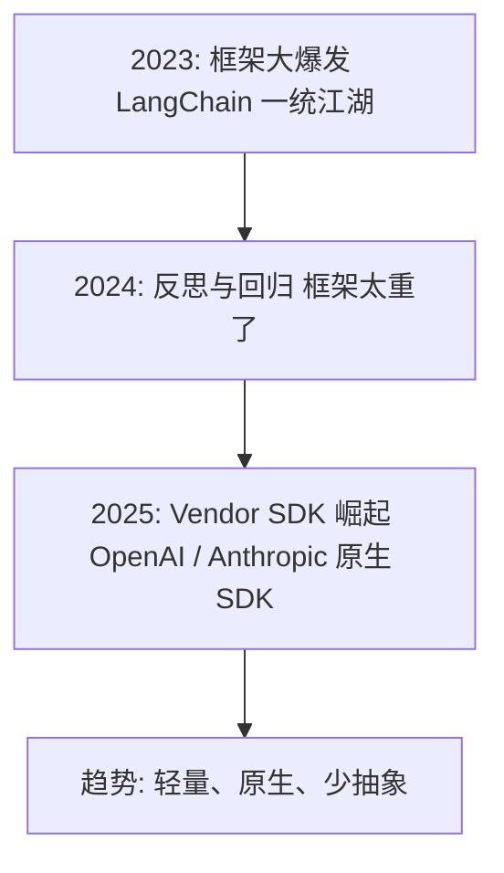
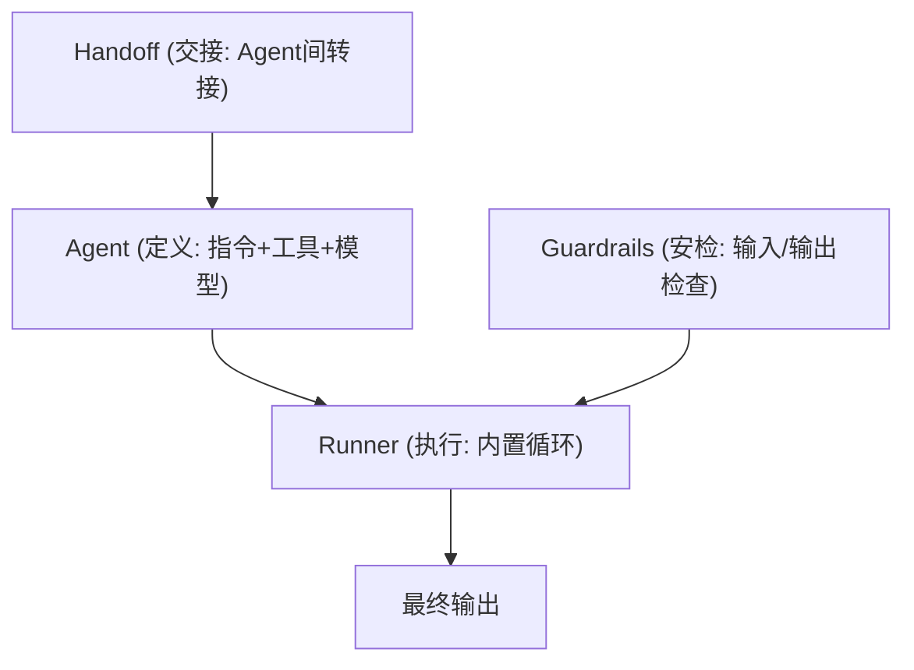
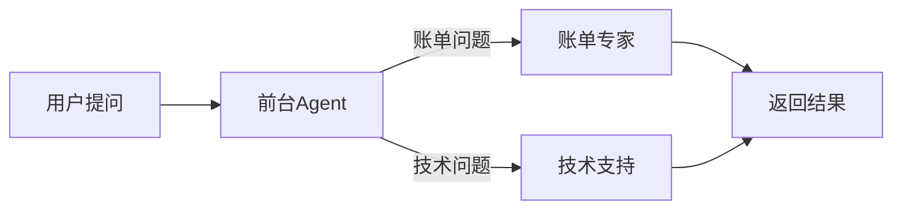
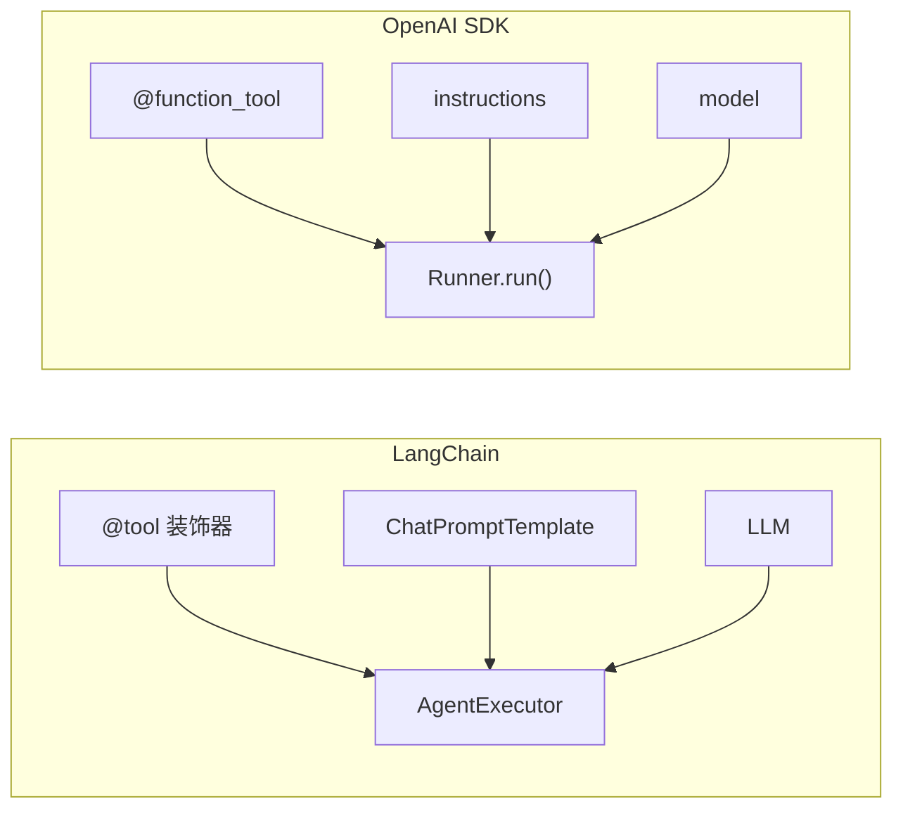

> 基于 [Lion-1209/AgentStudy](https://github.com/Lion-1209/AgentStudy) 仓库，对应代码见 `stage3-vendor-sdk/task3.1_openai_agents_sdk.py`

---

## 去框架化趋势

LangChain 很好，但有时候你不需要那么重的框架。



**OpenAI Agents SDK 就是"去框架化"的代表。**

---

## OpenAI Agents SDK 三要素



---

## 5 分钟搭 Agent

```python
from agents import Agent, Runner

# 定义工具
@function_tool
def get_weather(city: str) -> str:
    """获取城市天气"""
    return f"{city}: 晴天 25°C"

# 定义 Agent
agent = Agent(
    name="天气助手",
    instructions="你是一个天气助手。用中文回答。",
    tools=[get_weather],
    model="gpt-4o-mini",
)

# 运行
result = Runner.run_sync(agent, "北京天气怎么样？")
print(result.final_output)
```

**对比 LangChain：代码更少，抽象更少，更直觉。**

---

## Agent Handoff：Agent 之间的转接

```python
# 定义两个专业 Agent
billing_agent = Agent(
    name="账单专家",
    handoff_description="处理账单、退款、订阅问题",
    instructions="你是账单专家...",
)

support_agent = Agent(
    name="技术支持",
    handoff_description="处理技术问题、Bug 报告",
    instructions="你是技术支持...",
)

# 主 Agent 可以转接给子 Agent
triage_agent = Agent(
    name="前台",
    instructions="你是前台。根据用户问题转接给合适的专家。",
    handoffs=[billing_agent, support_agent],
)
```



**就像电话总机转接：前台判断用户要找谁，然后转过去。**

---

## Guardrails：输入/输出安全检查

```python
from agents import input_guardrail, output_guardrail

@input_guardrail
async def check_input(ctx, agent, input_data):
    """检查用户输入是否包含敏感内容"""
    if "密码" in input_data:
        return GuardrailResult(tripwire_triggered=True)
    return GuardrailResult(tripwire_triggered=False)

@output_guardrail
async def check_output(ctx, agent, output_data):
    """检查 Agent 输出是否包含敏感内容"""
    if "密钥" in output_data:
        return GuardrailResult(tripwire_triggered=True)
    return GuardrailResult(tripwire_triggered=False)

agent = Agent(
    name="安全助手",
    tools=[...],
    input_guardrails=[check_input],
    output_guardrails=[check_output],
)
```

---

## vs LangChain 代码对比



| 维度 | LangChain | OpenAI SDK |
|------|-----------|------------|
| 工具定义 | `@tool` + docstring | `@function_tool` + docstring |
| Agent 创建 | `create_agent(llm, tools)` | `Agent(name, instructions, tools)` |
| 运行 | `agent.invoke({...})` | `Runner.run_sync(agent, input)` |
| 代码行数 | ~100 | ~80 |
| 抽象层数 | 多 | 少 |

---

## 学习检查清单

- [ ] 能用 OpenAI Agents SDK 搭一个简单 Agent 吗？
- [ ] 理解 Handoff 的用途了吗？
- [ ] 知道 Guardrails 能做什么吗？

---

## 延伸阅读

- 💻 完整代码：`stage3-vendor-sdk/task3.1_openai_agents_sdk.py`
- 📖 OpenAI 文档：https://platform.openai.com/docs/guides/agents
- 🗺️ 上一篇：[11] LangGraph 实战
- 🗺️ 下一篇：[13] Claude Agent SDK
