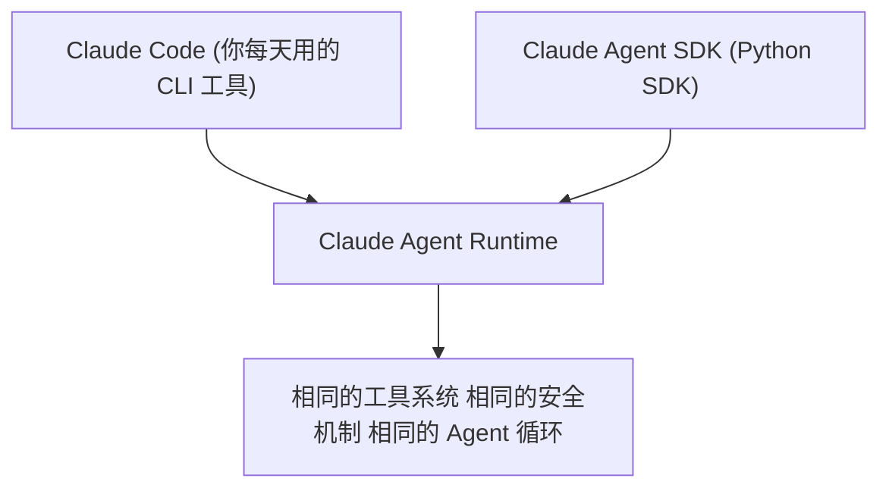
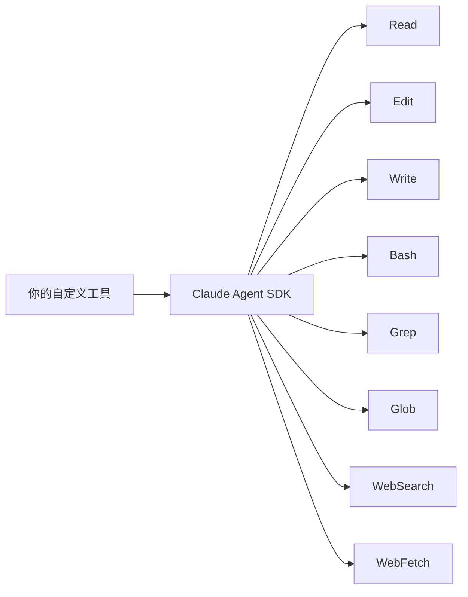
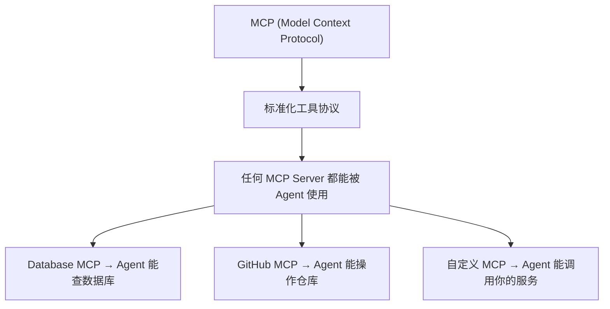

> 基于 [Lion-1209/AgentStudy](https://github.com/Lion-1209/AgentStudy) 仓库，对应代码见 `stage3-vendor-sdk/task3.2_claude_agent_sdk.py`

---

## 为什么叫"同源"？

Claude Agent SDK 和 Claude Code 使用的是完全相同的运行时。



**你在 Claude Code 里能做的事，SDK 都能做，反之亦然。**

---

## 8 个内置工具

Claude Agent SDK 开箱即用 8 个工具：

| 工具 | 功能 | 类比 |
|------|------|------|
| **Read** | 读取文件 | cat |
| **Edit** | 编辑文件 | sed |
| **Write** | 写入文件 | tee |
| **Bash** | 执行 shell 命令 | 终端 |
| **Grep** | 搜索文件内容 | grep |
| **Glob** | 查找文件路径 | find |
| **WebSearch** | 搜索网络 | Google |
| **WebFetch** | 抓取网页内容 | curl |



**你不需要自己实现这些基础工具，开箱即用。**

---

## 快速上手

```python
from claude_agent_sdk import Agent, Runner

agent = Agent(
    name="代码助手",
    model="claude-sonnet-4-20250514",
    system_prompt="你是一个代码助手。",
)

result = Runner.run_sync(
    agent,
    "读取 README.md，总结项目结构"
)
print(result.output)
```

**Agent 会自动使用 Read 工具读取文件。**

---

## 自定义工具

```python
from claude_agent_sdk import tool

@tool
def deploy_service(service_name: str, env: str = "production") -> str:
    """部署服务到指定环境。

    Args:
        service_name: 服务名称
        env: 部署环境（dev/staging/production）
    """
    return f"{service_name} 已部署到 {env}"

agent = Agent(
    name="DevOps助手",
    tools=[deploy_service],
)
```

---

## MCP 协议集成



**MCP 让 Agent 的能力可以像插件一样扩展，不需要修改 Agent 代码。**

```python
# 配置 MCP Server
agent = Agent(
    name="全栈助手",
    mcp_servers={
        "github": "https://github.com/modelcontextprotocol/servers",
        "database": "./mcp-servers/database",
    },
)
```

---

## OpenAI SDK vs Claude SDK 对比

| 维度 | OpenAI SDK | Claude SDK |
|------|------------|------------|
| 内置工具 | 无 | 8 个（Read/Edit/Write/Bash/Grep/Glob/WebSearch/WebFetch） |
| MCP 支持 | 有 | 原生支持 |
| Handoff | 有 | 有（类似概念） |
| Guardrails | 有 | 有 |
| 运行时 | 独立 | 与 Claude Code 同源 |
| 适合场景 | 通用 | Claude 生态、代码任务 |

---

## 学习检查清单

- [ ] 知道 Claude SDK 的 8 个内置工具吗？
- [ ] 能写一个自定义工具吗？
- [ ] 理解 MCP 协议的作用了吗？

---

## 延伸阅读

- 💻 完整代码：`stage3-vendor-sdk/task3.2_claude_agent_sdk.py`
- 📖 MCP 文档：https://modelcontextprotocol.io/
- 🗺️ 上一篇：[12] OpenAI Agents SDK
- 🗺️ 下一篇：[14] CrewAI 多 Agent 协作
