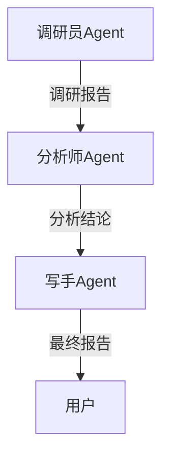
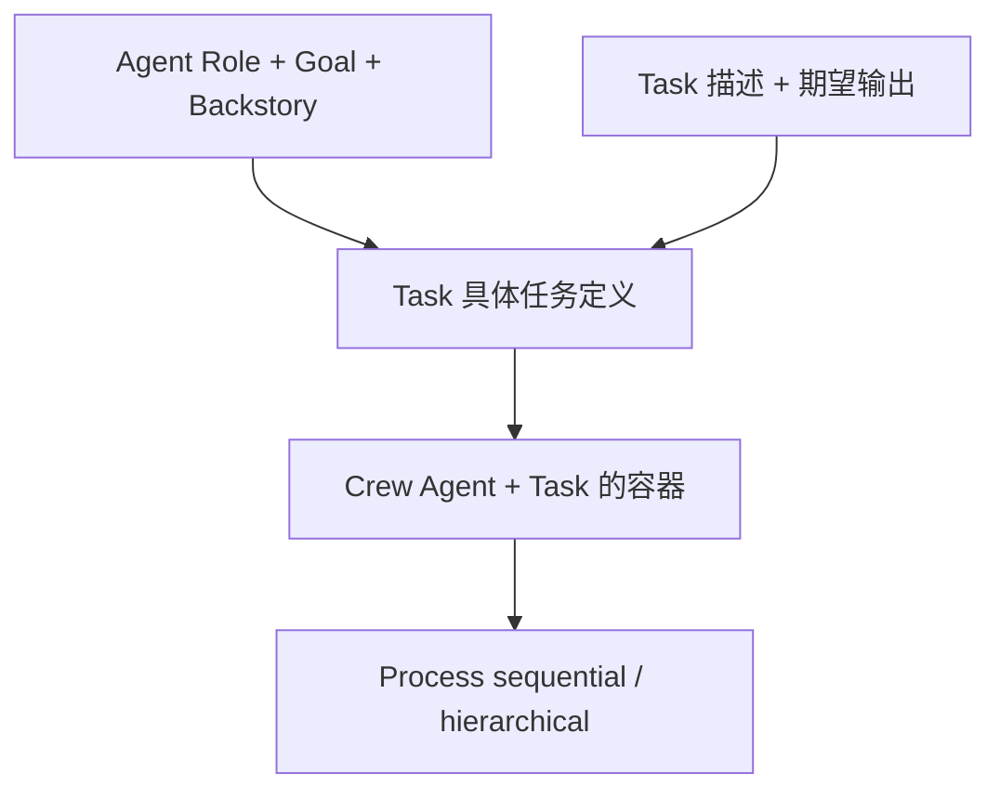
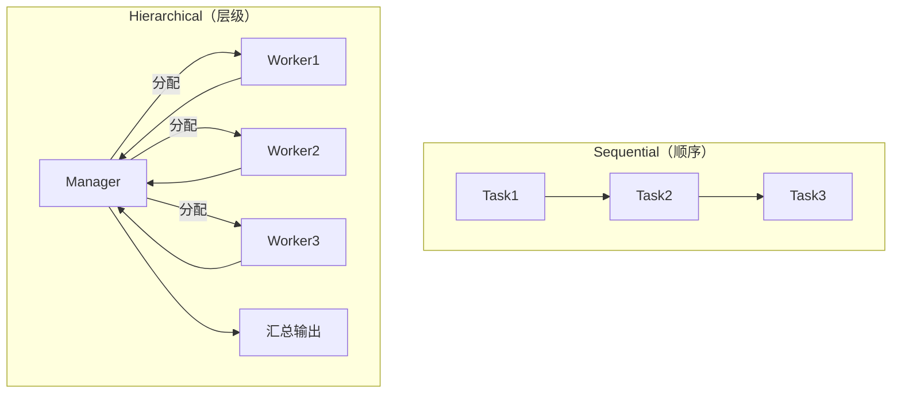

> 基于 [Lion-1209/AgentStudy](https://github.com/Lion-1209/AgentStudy) 仓库，对应代码见 `stage4-advanced/task4.1_crewai_multiagent.py`

---

## 多 Agent 的本质

**Multi-Agent = 多个 Agent 之间传递字符串。**

听起来很朴实，但这就是真相。CrewAI 包装了"角色扮演"的概念，让多 Agent 协作更直觉。



---

## CrewAI 三要素



| 要素 | 作用 | 类比 |
|------|------|------|
| **Agent** | 定义角色、目标、背景 | 招聘岗位描述 |
| **Task** | 定义具体任务和期望输出 | 工作任务单 |
| **Crew** | 把 Agent 和 Task 组织起来 | 项目团队 |
| **Process** | 决定执行顺序 | 工作流程 |

---

## 定义 Agent：角色扮演

```python
from crewai import Agent

researcher = Agent(
    role="调研员",
    goal="对技术趋势进行深入调研",
    backstory="你是一位经验丰富的技术分析师...",
    verbose=True,
)
```

> Role + Goal + Backstory 的作用：这三点共同塑造了 Agent 的"人格"。LLM 会根据这些信息调整输出风格和重点。

---

## 定义 Task

```python
from crewai import Task

research_task = Task(
    description="调研 2026 年 AI Agent 最重要的技术趋势",
    expected_output="一份包含 5 个趋势的调研报告，每个趋势 100 字以内",
    agent=researcher,
)
```

---

## 组合成 Crew

```python
from crewai import Crew

crew = Crew(
    agents=[researcher, analyst, writer],
    tasks=[research_task, analysis_task, writing_task],
    process="sequential",  # 顺序执行
)

# 运行
result = crew.kickoff()
print(result.raw)
```

---

## 两种执行模式



| 模式 | 适用场景 | 特点 |
|------|----------|------|
| **Sequential** | 线性流程 | 简单直观，适合串行任务 |
| **Hierarchical** | 复杂协作 | Manager 自动分配和汇总 |

---

## 对比：从零实现 vs CrewAI

| 维度 | 从零实现（Task 4.2） | CrewAI |
|------|---------------------|--------|
| Agent 定义 | `SimpleAgent(name, prompt)` | `Agent(role, goal, backstory)` |
| 任务定义 | 手动传字符串 | `Task(description, expected_output)` |
| 流程控制 | 手动调用 | `process="sequential/hierarchical"` |
| 角色塑造 | 靠 system prompt | 结构化 Role + Backstory |
| 代码量 | 少 | 稍多但更声明式 |

---

## 学习检查清单

- [ ] 能解释 Role / Goal / Backstory 各自的作用吗？
- [ ] 知道 Sequential 和 Hierarchical 的区别吗？
- [ ] 能对比 CrewAI 和从零实现的优劣吗？

---

## 延伸阅读

- 💻 完整代码：`stage4-advanced/task4.1_crewai_multiagent.py`
- 📖 概念文档：`docs/stage4/division-of-labor.md`
- 🗺️ 上一篇：[13] Claude Agent SDK
- 🗺️ 下一篇：[15] 从零实现 Multi-Agent
