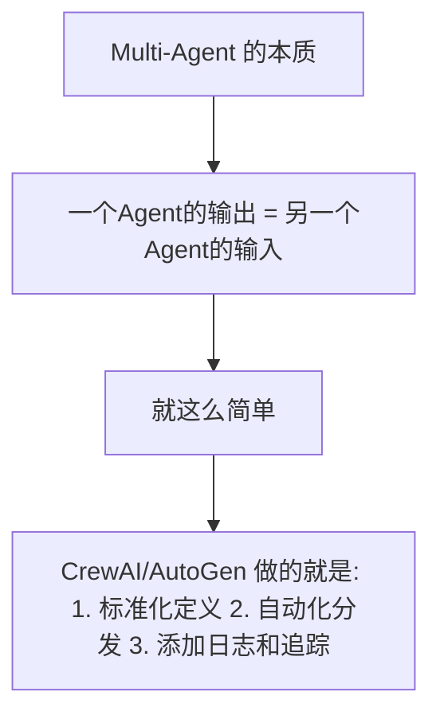
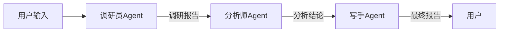
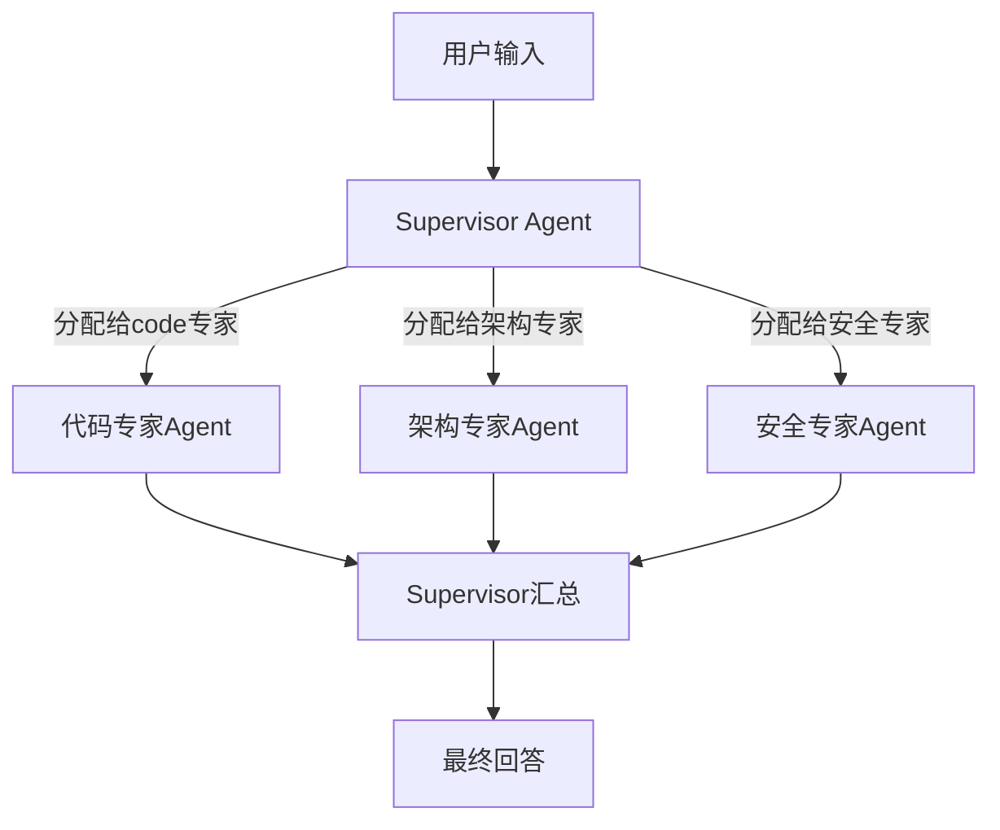
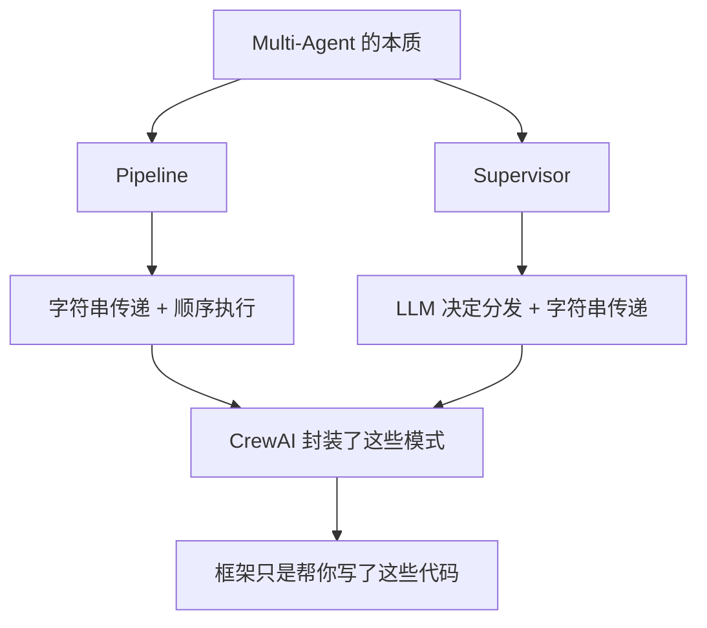

> 基于 [Lion-1209/AgentStudy](https://github.com/Lion-1209/AgentStudy) 仓库，对应代码见 `stage4-advanced/task4.2_multiagent_from_scratch.py`

---

## 去掉框架后的真相



**Multi-Agent 没有你想象的那么神秘。**

---

## 模式一：Pipeline（管道）

Agent 按顺序依次处理，前一个的输出是后一个的输入。



```python
class SimpleAgent:
    def __init__(self, name, system_prompt):
        self.name = name
        self.system_prompt = system_prompt

    def run(self, user_input):
        response = client.chat.completions.create(
            model=model,
            messages=[
                {"role": "system", "content": self.system_prompt},
                {"role": "user", "content": user_input}
            ]
        )
        return response.choices[0].message.content

# Pipeline 执行
researcher = SimpleAgent("调研员", "你是调研分析师...")
analyst = SimpleAgent("分析师", "你是技术分析师...")
writer = SimpleAgent("写手", "你是技术写手...")

step1 = researcher.run(query)
step2 = analyst.run(step1)
step3 = writer.run(step2)
```

**类比 Unix 管道：`cat file | grep pattern | sort | uniq`**

---

## 模式二：Supervisor（监督者）

一个 Agent 负责任务分发，其他 Agent 执行具体任务。



```python
# Worker Agents
code_agent = SimpleAgent("代码专家", "你是代码专家...")
arch_agent = SimpleAgent("架构专家", "你是架构专家...")
sec_agent = SimpleAgent("安全专家", "你是安全专家...")

workers = {"code": code_agent, "arch": arch_agent, "sec": sec_agent}

# Supervisor Agent
supervisor = SimpleAgent(
    "Supervisor",
    f"""你是任务分发者。根据用户问题，决定咨询哪些专家。
    可用专家: {list(workers.keys())}
    返回 JSON: {{"tasks": {{"专家名": "问题"}}}}"""
)

# 1. Supervisor 分析任务
plan = supervisor.run(user_query)
tasks = json.loads(extract_json(plan))["tasks"]

# 2. 分发给 Worker
results = {}
for name, task in tasks.items():
    results[name] = workers[name].run(task)

# 3. Supervisor 汇总
summary = supervisor.run(f"汇总: {results}")
```

---

## 两种模式对比

| 维度 | Pipeline | Supervisor |
|------|----------|------------|
| 流程 | 固定顺序 | 动态分发 |
| 灵活性 | 低 | 高 |
| 复杂度 | 低 | 中 |
| 适用场景 | 线性任务（调研→分析→报告） | 分类任务（问题→分发专家） |
| Agent 数量 | 固定 | 可动态增减 |

---

## 核心感悟



**去掉框架后你会发现：Multi-Agent 的底层就是 LLM 调用 + 字符串传递。**

框架的价值在于标准化、自动化和可观测性，但核心机制并不复杂。

---

## 学习检查清单

- [ ] 能手写 Pipeline 模式的代码吗？
- [ ] 能手写 Supervisor 模式的代码吗？
- [ ] 理解"Multi-Agent = 字符串传递"了吗？

---

## 延伸阅读

- 💻 完整代码：`stage4-advanced/task4.2_multiagent_from_scratch.py`
- 📖 概念文档：`docs/stage4/division-of-labor.md`
- 🗺️ 上一篇：[14] CrewAI 多 Agent 协作
- 🗺️ 下一篇：[16] 综合项目：AI 代码分析助手
