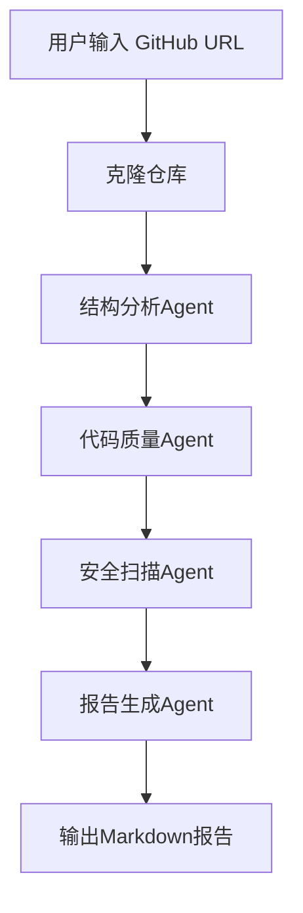
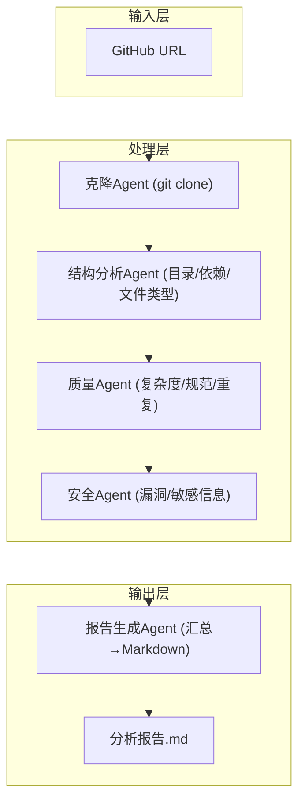
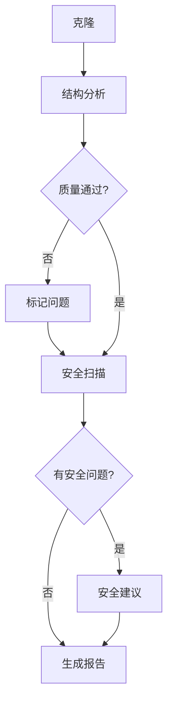
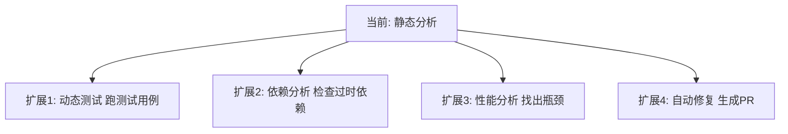

> 基于 [Lion-1209/AgentStudy](https://github.com/Lion-1209/AgentStudy) 仓库，架构设计来自 `LEARNING_PLAN.md` Task 4.3

---

## 项目目标

输入一个 GitHub 仓库 URL，自动分析代码结构、质量、安全风险，生成完整报告。

---

## 系统架构

---

## 5 个 Agent 的职责

| Agent | 职责 | 输出 |
|-------|------|------|
| **克隆 Agent** | 克隆仓库到本地 | 本地文件路径 |
| **结构分析 Agent** | 分析目录结构、文件类型、依赖关系 | 结构报告 |
| **代码质量 Agent** | 检查代码规范、复杂度、重复代码 | 质量评分 |
| **安全扫描 Agent** | 检查常见漏洞、敏感信息泄露 | 安全风险列表 |
| **报告生成 Agent** | 汇总所有分析结果，生成 Markdown | 完整报告 |

---

## 为什么用 LangGraph？

**有明确步骤、条件分支、循环重试 → LangGraph 是天然选择。**

---

## 可选框架实现

| 框架 | 理由 | 复杂度 |
|------|------|--------|
| **LangGraph（推荐）** | 流水线清晰，条件分支多 | 中等 |
| **OpenAI Agents SDK** | 轻量，适合快速原型 | 低 |
| **CrewAI** | 角色定义清晰 | 中等 |
| **从零实现** | 理解 Multi-Agent 本质 | 高 |

---

## 扩展思路

---

## 学习检查清单

- [ ] 能画出完整的系统架构图吗？
- [ ] 知道每个 Agent 的职责边界吗？
- [ ] 理解为什么这个项目适合用 LangGraph 吗？

---

## 延伸阅读

- 💻 项目代码：`stage4-advanced/task4.3_code_analyzer/`（待完成）
- 📖 架构设计：`LEARNING_PLAN.md` Task 4.3
- 🗺️ 上一篇：[15] 从零实现 Multi-Agent
- 🗺️ 下一篇：系列完结
